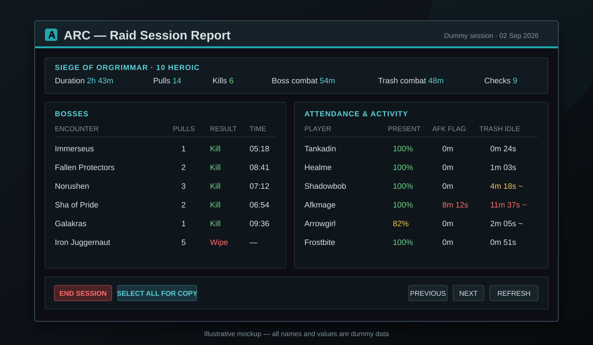

# ARC user guide

This guide covers normal installation and use of Advanced Raid Check. For the
exact validation rules, follow the links in [Documentation map](#documentation-map).

## Installation and updates

1. Put the `ARC` directory in `World of Warcraft/Interface/AddOns/`.
2. Verify that the final path is `Interface/AddOns/ARC/ARC.toc`, not a nested
   `ARC/ARC/ARC.toc`.
3. Fully exit WoW to the desktop and restart it after every ARC update.

The 5.4.8 client can retain an old TOC/file list through `/reload` or logout.
A full restart is especially important when an update adds a new Lua module.
Enable **Load out of date AddOns** only if the server reports a different
interface number despite using a 5.4.8 client.

Do not rename the `ARC` folder or install a second copy under the old product
name. `ARC.toc`, `/arc`, `ARC_DB`, frame names and the `ARC1` communication
prefix intentionally remain stable.

ARC has no required library dependencies. When ElvUI is loaded, ARC adopts its
frame template, media colors, fonts, buttons, row highlights and icon borders.

## Main window

The top banner combines raid-setup validation with the overall pull verdict:

- **READY TO PULL** — every currently available required check passed.
- **NOT READY** — one or more confirmed problems exist.
- **CHECK INCOMPLETE** — no confirmed problem exists, but required data is
  unavailable or still being collected.

Offline, dead and AFK players block the pull verdict. ARC does not count
unavailable aura data as a missing flask or food.

The roster shows ready state, role, specialization, consumables, raid buffs,
gear, talents, class readiness, Healthstones and ARC client state. Hover a row
for details. Right-click a row for **Whisper**, **Inspect**, **ARC Check** and
**Remind**. Reminder messages include only confirmed personal issues and omit
unavailable data.

The 25-player roster scrolls and caps its height to the current screen and ARC
scale. The footer shows inspect progress as scanned/total plus waiting or
unavailable players. Hover the Stam, Stat, Crit or Mast header to see the
detected source of that raid buff.

### Row colors and name labels

| Appearance | Meaning |
| --- | --- |
| Strongly faded, `(off)` | Offline |
| Soft red, `(dead)` | Dead or ghost |
| Soft orange, `(afk)` | AFK |
| Soft grey | Aura or required inspect data is out of range |
| Soft yellow | Waiting for the first inspect result |

Flask and food icons turn amber when fewer than five minutes remain. The ARC
column marks an older detected client as **Old** rather than current.

## Opening mode and ready-check response

ARC opens automatically when a ready check begins unless **Manual opening
only** is enabled in Options. `/arc manual on` enables manual mode,
`/arc manual off` disables it and `/arc manual` toggles it.

Manual mode does not stop ready-check tracking, close an already open window or
suppress Blizzard's ready-check dialog. Combat auto-hide is an independent
setting.

**Ready** and **Not Ready** in the top-right corner answer your own active
ready check. They are disabled outside a check, after your response or when it
expires. ARC never responds automatically. Answering through Blizzard's dialog
continues to work.

## Raid setup check

Click the banner, use `/arc raid`, or select **Raid Setup Checks** in Options.
You can independently choose an expected mode (10/25 Normal/Heroic, Raid
Finder or Flexible) and loot method. Both start as **Not checked** so ARC does
not guess the server's preferred setup.

- Red **RAID SETUP MISMATCH** shows actual and expected settings.
- Amber **UNVERIFIED** means the game did not return required data.
- Amber **NOT CONFIGURED** asks you to select expectations.
- Green **OK** means every enabled expectation matches.

Inside a raid instance, instance difficulty takes precedence over selected raid
difficulty. Outside it, selected difficulty is used. 10/25 describes the mode's
capacity rather than current invited-player count. ARC never changes raid or
loot settings, starts a ready check or sends chat by itself.

## Minimum item level

Options contains a numeric minimum item-level field, default **450**. Enter a
whole number from **400 to 600**, then press **Enter** or **Apply**. **Escape**
cancels an edit. Invalid or empty input leaves the previous value unchanged.

Changing the threshold invalidates raid gear results and rescans your own gear.
An already open standalone report keeps the threshold used for its snapshot
until **Refresh** is clicked.

## Standalone ARC Check

Target a nearby player and use `/arc check`, click **ARC Check** in the normal
inspect window, use ARC's roster menu, or choose it in a compatible standard
player menu. The player does not need ARC and does not need to be in your group.

The report starts with identity, class/level, spec/role, guild and estimated
upgraded item level. It then lists only confirmed problems and unverified
results. Healthy equipment is intentionally omitted because the normal inspect
window already shows it.

Problem equipment includes the actual item icon and name. Hover the icon for
the native item tooltip captured for that snapshot. Empty slots have no icon;
unavailable icon data uses a question mark.

**Refresh** always rechecks the same character. If that character is no longer
available, the previous snapshot remains labelled rather than silently using a
new target. A manual check takes priority over background raid inspection.

Name-only menus such as chat or friends can offer ARC Check only if the exact
name/realm resolves to a current target, focus, mouseover or group unit. The
WoW client cannot inspect an arbitrary name without a valid nearby player unit.

If the game reports that `ARC_PlayerCheck.lua` is not loaded, fully restart the
client, verify that the file is beside `ARC.toc` and reinstall the complete
release. ARC keeps the raid window working and reports the unavailable module
instead of repeatedly throwing errors.

## Raid session report

Use **Session Report** in the main window or Options. Sessions are opt-in: start
one before the raid and end it when finished. ARC records attendance, observed
AFK flags, encounter pulls/kills, first deaths, ready-check snapshots, trash
combat and estimated trash inactivity. The newest ten completed reports are
kept, and an active session survives `/reload`.

> Illustrative mockup with dummy data. Trash inactivity is an estimate, not
> proof that a player was AFK.

See [Session reports](SESSION_REPORT.md) for exact timing and caveats.

## Commands

| Command | Action |
| --- | --- |
| `/arc` | Show or hide the window |
| `/arc lock` / `/arc unlock` | Lock or unlock window movement |
| `/arc reset` | Reset window position |
| `/arc autohide` | Toggle hiding at combat start |
| `/arc manual [on\|off]` | Toggle or set manual-only opening |
| `/arc minimap` | Toggle the minimap button |
| `/arc options` | Open options |
| `/arc raid` | Configure expected raid and loot settings |
| `/arc check` | Check the targeted player |
| `/arc session` | Open the active or newest session report |
| `/arc session start` | Begin session tracking |
| `/arc session end` | Finish and save the active session |
| `/arc help` | Print the command list |

Settings are stored account-wide in `ARC_DB`.

## Documentation map

- [Readiness checks](READINESS_CHECKS.md) — talent, self-buff, tank, pet,
  Growl, Healthstone and addon-report rules.
- [Gear rules](GEAR_RULES.md) — detailed item, gem and enchant policy.
- [Session reports](SESSION_REPORT.md) — session metrics and limitations.
- [Data and limitations](DATA_AND_LIMITATIONS.md) — data sources, freshness
  and what requires ARC on the other player.
- [Architecture](ARCHITECTURE.md) — source modules, load order and stable
  compatibility identifiers.
- [Testing](TESTING.md) — live checklist before publishing.
- [Release checklist](RELEASE_CHECKLIST.md) — version and GitHub workflow.
